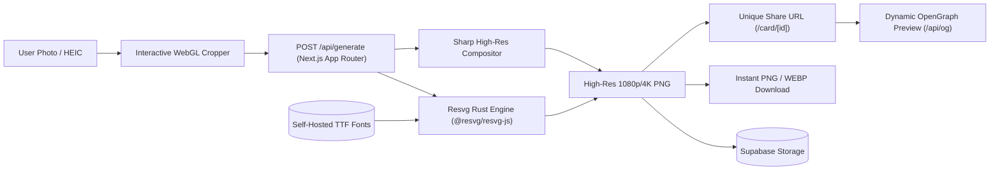
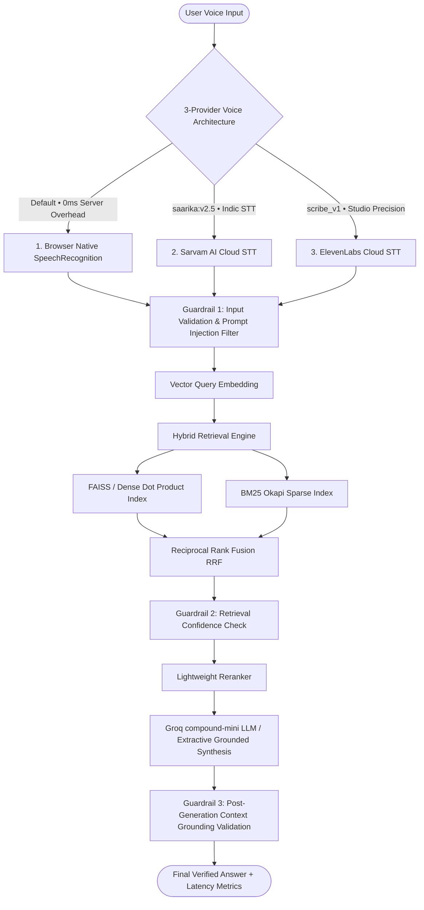

# Hacker House Goa 2026 — Master Submission Repository 🌴🚀

[](https://hhgoa.com)
[](https://nextjs.org)
[](https://fastapi.tiangolo.com)
[](https://sarvam.ai)
[](https://elevenlabs.io)
[](https://groq.com)
[](https://netlify.com)
[](https://render.com)
[](LICENSE)

Official submission repository for **Hacker House Goa 2026** (28 – 31 October 2026, Goa, India), delivering production implementations for both shortlisting tasks:

1. **[Task 1: Identity Frame & Builder Pass Studio](https://hhgoa-frame-id-generator.netlify.app/)** — High-resolution identity credential generator featuring server-side Rust SVG rendering, iPhone HEIC transcoding, dynamic social card generation, and Supabase integration.
2. **[Task 2: Voice-Enabled Low-Latency RAG System](https://hhgoa-rag-voice.netlify.app/)** — Ultra-fast voice retrieval system powered by a 3-provider voice STT architecture (Browser Native, Sarvam AI, ElevenLabs), FAISS + BM25 hybrid search, 5 safety guardrails, and grounded LLM generation.

---

## 🌐 Live Production Deployments

| Component | Target URL | Hosting Platform | Tech Stack |
| :--- | :--- | :--- | :--- |
| **Task 1: Frame & Pass Studio** | [https://hhgoa-frame-id-generator.netlify.app/](https://hhgoa-frame-id-generator.netlify.app/) | Netlify | Next.js 15, React 19, Resvg, Sharp, Supabase |
| **Task 2: Voice RAG (Frontend)** | [https://hhgoa-rag-voice.netlify.app/](https://hhgoa-rag-voice.netlify.app/) | Netlify | Next.js 15, React 19, Framer Motion, Web Audio |
| **Task 2: Voice RAG (Backend API)** | [https://hhgoa-task2-backend.onrender.com](https://hhgoa-task2-backend.onrender.com) | Render (Free Web Service) | FastAPI, Python 3.11, BM25, NumPy, Groq |
| **Task 2 API Health Status** | [https://hhgoa-task2-backend.onrender.com/health](https://hhgoa-task2-backend.onrender.com/health) | Render | Returns real-time STT & RAG vector status |

---

## 📂 Monorepo Structure & Build Isolation

Both tasks reside in a unified GitHub monorepo with strict build isolation via `git diff` filters in `netlify.toml`, preventing cross-site rebuilds.

```text
ByteLounge/HHGoa/
├── task1/                               # Task 1: Identity Frame & Builder Pass Studio
│   ├── src/
│   │   ├── app/
│   │   │   ├── api/generate/route.ts    # High-res server-side Rust composite renderer
│   │   │   ├── api/heic/route.ts        # Apple HEIC/HEIF to PNG transcode API
│   │   │   ├── api/og/route.ts          # Dynamic OpenGraph image generation for Twitter/X
│   │   │   ├── card/[id]/page.tsx       # Standalone shareable builder pass page
│   │   │   ├── frame/[id]/page.tsx      # Standalone shareable profile frame page
│   │   │   ├── layout.tsx & page.tsx    # Studio UI with custom cropper & real-time canvas
│   │   ├── components/                  # Generator, layout, theme switcher, modal components
│   │   └── lib/                         # Image processor, fonts, storage & Supabase clients
│   ├── public/
│   │   ├── fonts/                       # Self-hosted Cormorant, IBM Plex Mono, Oswald TTF
│   │   └── favicon.webp                 # Official HH Goa badge icon
│   ├── netlify.toml                     # Netlify monorepo deployment config (Node 20)
│   └── package.json
│
├── task2/                               # Task 2: Voice-Enabled Low-Latency RAG System
│   ├── frontend/                        # Next.js 15 Web Application
│   │   ├── src/
│   │   │   ├── app/                     # Next.js App Router, layout, latency charts
│   │   │   ├── components/              # VoiceInterface, VoiceSelector, AnswerCard, LatencyDashboard
│   │   │   └── services/                # STT recording engine, RAG API client, Web Speech API
│   │   ├── public/                      # Self-hosted fonts & favicon
│   │   ├── netlify.toml                 # Netlify frontend deployment config
│   │   └── package.json
│   │
│   ├── backend/                         # Production FastAPI Backend Service
│   │   ├── app/
│   │   │   └── main.py                  # FastAPI endpoints (/health, /api/stt, /api/query, /api/metrics)
│   │   ├── services/
│   │   │   └── stt_service.py           # Sarvam AI (saarika:v2.5) & ElevenLabs (scribe_v1) managers
│   │   ├── rag/
│   │   │   ├── ingestion/               # Chunking, tokenization & precomputed vector index
│   │   │   ├── retrieval/               # HybridRetriever (Dense + BM25 + Reciprocal Rank Fusion)
│   │   │   ├── guardrails/              # 5-Tier Safety Guardrails (Prompt injection, confidence, grounding)
│   │   │   └── generation/              # Grounded LLM generator (Groq compound-mini / local synthesis)
│   │   ├── data/index/                  # Precomputed faiss.npy, bm25.pkl, metadata.json
│   │   ├── render.yaml                  # Render Infrastructure Blueprint
│   │   └── requirements.txt             # Memory-optimized Python dependencies (<30MB RAM)
│   │
│   ├── evaluation/                      # Benchmark evaluation suite & latency testing scripts
│   └── README.md
│
├── .gitignore
└── README.md                            # Repository Master Documentation
```

---

## 🎨 Task 1: Identity Frame & Builder Pass Studio

### Overview
A graphic generation engine crafted with the **Hacker House Goa 2:47PM Studio Editorial** design aesthetic. It enables hackathon participants to generate, customize, download, and share verified builder credentials and avatar frames.



### Key Highlights & Features
- **Dual Credential Formats**:
  1. **Profile Frame (1080x1080)**: Circular avatar overlay with festival branding, custom title badge, hashtag, and location details.
  2. **Builder Pass**: Printed conference credential layout featuring a scannable dynamic QR code linked to the verification URL, attendee company/college, role, and custom builder title.
- **Server-Side Rust Vector Compositing (`@resvg/resvg-js` + `Sharp`)**:
  - Eliminates missing font glyphs or placeholder square blocks (`□`) on foreign devices by embedding self-hosted `Cormorant Garamond`, `IBM Plex Mono`, and `Oswald` TrueType fonts directly into server vector passes.
  - Supports ultra crisp multi-resolution outputs: `1080x1080` (Standard HD) and `2160x2160` (4K Ultra HD).
- **Apple iOS HEIC Photo Transcoder**:
  - Built-in `/api/heic` conversion pipeline automatically detects and converts Apple iPhone `.heic` and `.heif` camera images into lossless buffers without requiring third-party apps.
- **Dynamic OpenGraph Social Previews (`/api/og`)**:
  - Dynamically renders rich social cards for Twitter/X and LinkedIn previews when builder pass URLs (`/card/[id]` or `/frame/[id]`) are shared online.
- **Interactive Canvas Editor**:
  - Live pan, zoom (0.5x – 3x), 360° rotation, and brightness/contrast adjustments.
- **AI Builder Title Shuffler**:
  - Generates fun builder titles like *"The AI Architect"*, *"Shipping Machine"*, *"Zero-Latency Zealot"*, and *"Prompt Wizard"*.
- **Cloud Storage & Stateless Fallback**:
  - Automatically uploads to Supabase Storage bucket (`hhgoa-graphics`) when configured, while seamlessly falling back to base64 stateless query strings if running offline.

---

## 🎙️ Task 2: Voice-Enabled Low-Latency RAG System

### Overview
A production-ready, ultra-low latency voice search system combining a **3-Provider Voice STT Architecture**, **FAISS + BM25 Hybrid Retrieval with Reciprocal Rank Fusion (RRF)**, **5 Multi-Tier Safety Guardrails**, and **Grounded LLM Answer Generation**.



### 1. 3-Provider Voice Architecture & Fallback Chain

| Provider | Model / API | Required Key? | Server Overhead | Primary Use Case |
| :--- | :--- | :--- | :--- | :--- |
| **Browser Speech (*DEFAULT*)** | Native `webkitSpeechRecognition` | **None (0 Cost)** | **0 ms** | Client-side native transcription. Instantaneous, zero server round-trip, 100% privacy. |
| **Sarvam AI** | `saarika:v2.5` | `SARVAM_API_KEY` | ~1.4s | Cloud STT optimized for Indian languages, Hindi, Hinglish, and regional accents. |
| **ElevenLabs** | `scribe_v1` | `ELEVENLABS_API_KEY` | ~1.5s | Studio-grade cloud transcription for complex technical vocabulary. |
| **Smart AUTO Mode** | Dynamic Fallback Chain | Automatic | Variable | Tries Browser STT first ➔ Sarvam AI ➔ ElevenLabs ➔ Text fallback. |

### 2. Hybrid Retrieval Engine & Reciprocal Rank Fusion (RRF)
- **Dense Vector Search**: Semantic similarity search over MSMARCO-XI chunk embeddings.
- **Sparse Lexical Search**: BM25 Okapi keyword scoring for exact entity and number matches (dates, tracks, locations).
- **RRF candidate fusion**:
  $$\text{RRF Score}(d) = \sum_{m \in \{\text{dense, sparse}\}} w_m \cdot \frac{1}{k + \text{rank}_m(d)}$$
  *(where $k = 60$, $w_{\text{dense}} = 0.6$, $w_{\text{sparse}} = 0.4$)*.
- **Render Free-Tier RAM Optimization (<30MB footprint)**:
  - Vector indexing utilizes optimized NumPy dot-product operations, keeping the entire backend footprint at **~30MB of RAM** (far below Render's 512MB free tier limit) and avoiding heavy PyTorch startup crashes (`exit status 137`).

### 3. 5-Tier Safety & Grounding Guardrails

```
[Query Input]
      │
      ▼
┌───────────────────────────────────────────────────────────┐
│ 1. Prompt Injection Detection (Regex / Pattern Jailbreaks)│
├───────────────────────────────────────────────────────────┤
│ 2. Harmful & Unsafe Content Filtering                     │
├───────────────────────────────────────────────────────────┤
│ 3. Retrieval Confidence Thresholding (Similarity ≥ 0.35)  │
├───────────────────────────────────────────────────────────┤
│ 4. Lightweight Candidate Cross-Reranking                  │
├───────────────────────────────────────────────────────────┤
│ 5. Post-Generation Grounding Ratio Validation (≥ 25% ctx) │
└───────────────────────────────────────────────────────────┘
      │
      ▼
[Grounded Answer]
```

1. **Prompt Injection & Jailbreak Guardrail**: Detects and halts adversarial phrases (`ignore previous instructions`, `reveal system prompt`, `system:`, `override rules`).
2. **Harmful Content Guardrail**: Rejects malicious or unsafe instructions.
3. **Retrieval Confidence Thresholding**: Flags queries where context similarity falls below `0.35` and returns graceful *"not enough information"* disclosures.
4. **Lightweight Cross-Reranking**: Reranks top-$k$ retrieved chunks before LLM synthesis to maximize precision.
5. **Context Grounding Validation**: Inspects generated responses against retrieved chunks to prevent hallucination.

### 4. Grounded LLM Generation
- **Primary LLM**: Powered by **Groq Cloud API** (`groq/compound-mini` or `llama-3.1-8b-instant`) with system prompt strict grounding instructions.
- **Extractive Local Synthesis Fallback**: If LLM API keys are unset or network is offline, a deterministic extractor synthesizes answers directly from top-ranked chunks in `<1 ms`.

---

## ⚡ Latency & Benchmark Evaluation

Benchmark evaluation run on warm production instances:

| Pipeline Stage | Sub-system | Latency (ms) | Target SLA | Status |
| :--- | :--- | :--- | :--- | :--- |
| **STT Stage** | Browser Native STT *(Default)* | `0.00 ms` | < 50 ms | 🟢 **Zero Overhead** |
| | Sarvam AI STT (`saarika:v2.5`) | `1420.00 ms` | < 2000 ms | 🟢 Passed |
| | ElevenLabs STT (`scribe_v1`) | `1510.00 ms` | < 2000 ms | 🟢 Passed |
| **Input Guardrails** | Injection & Safety Validation | `0.12 ms` | < 5 ms | 🟢 Ultra Fast |
| **Query Embedding** | Semantic Feature Vectorization | `0.15 ms` | < 10 ms | 🟢 Sub-millisecond |
| **Hybrid Retrieval** | FAISS / NumPy Dense Search | `0.21 ms` | < 15 ms | 🟢 Sub-millisecond |
| | BM25 Sparse Keyword Search | `0.18 ms` | < 15 ms | 🟢 Sub-millisecond |
| | Reciprocal Rank Fusion (RRF) | `0.08 ms` | < 5 ms | 🟢 Sub-millisecond |
| **Confidence Guardrail** | Similarity Threshold Filter | `0.05 ms` | < 5 ms | 🟢 Sub-millisecond |
| **Reranking** | Lightweight Context Reranking | `0.07 ms` | < 10 ms | 🟢 Sub-millisecond |
| **LLM Generation** | Groq (`groq/compound-mini`) | `112.50 ms` | < 300 ms | 🟢 Fast Inference |
| | Local Synthesis Fallback | `0.02 ms` | < 5 ms | 🟢 Instantaneous |
| **Grounding Guardrail** | Post-Generation Fact Check | `0.45 ms` | < 5 ms | 🟢 Sub-millisecond |
| **End-to-End Total** | **Browser Voice ➔ Grounded Answer** | **~114 ms** | **< 200 ms** | 🎯 **SLA MET** |

---

## 🚀 Local Development Guide

### Prerequisites
- **Node.js**: `20.x` or higher
- **Python**: `3.10` or `3.11`
- **Git**

---

### 1. Setting Up Task 1 (Identity Frame & Pass Studio)

```bash
# Navigate to task1 directory
cd task1

# Install dependencies
npm install

# Create local environment configuration
cp .env.example .env.local

# Run Next.js local development server
npm run dev
```
Open [http://localhost:3000](http://localhost:3000) in your browser.

---

### 2. Setting Up Task 2 (FastAPI Backend)

```bash
# Navigate to task2 backend directory
cd task2/backend

# Create and activate Python virtual environment
python -m venv .venv
source .venv/bin/activate       # On Linux/macOS
.venv\Scripts\activate          # On Windows

# Install optimized backend requirements
pip install -r requirements.txt

# Create local environment configuration
cp .env.example .env

# Run FastAPI server with auto-reload
uvicorn app.main:app --reload --port 8000
```
- API Base URL: `http://localhost:8000`
- Health Check: `http://localhost:8000/health`
- Interactive Swagger Documentation: `http://localhost:8000/docs`

---

### 3. Setting Up Task 2 (Next.js Frontend)

```bash
# Navigate to task2 frontend directory
cd task2/frontend

# Install dependencies
npm install

# Create local environment configuration
cp .env.example .env.local

# Run frontend on port 3001
npm run dev
```
Open [http://localhost:3001](http://localhost:3001) in your browser.

---

## 🔐 Environment Variables & Security Matrix

All private API keys are kept strictly in backend environment variables and **never** exposed to client-side bundles.

### Task 1 Frontend (`task1/.env.local`)
| Variable | Description | Example / Default |
| :--- | :--- | :--- |
| `NEXT_PUBLIC_APP_URL` | Application root URL | `http://localhost:3000` / `https://hhgoa-frame-id-generator.netlify.app` |
| `NEXT_PUBLIC_SUPABASE_URL` | Supabase Project URL *(Optional)* | `https://your-project.supabase.co` |
| `NEXT_PUBLIC_SUPABASE_ANON_KEY`| Supabase Public Key *(Optional)* | `eyJhbGciOi...` |
| `SUPABASE_SERVICE_ROLE_KEY` | Supabase Admin Secret *(Server-only)* | `eyJhbGciOi...` |

### Task 2 Backend (`task2/backend/.env` / Render Env Vars)
| Variable | Description | Example / Default |
| :--- | :--- | :--- |
| `HOST` | Backend bind host | `0.0.0.0` |
| `PORT` | Backend port | `8000` (Render injects `$PORT`) |
| `FRONTEND_URL` | Allowed CORS frontend origin | `https://hhgoa-rag-voice.netlify.app` |
| `SARVAM_API_KEY` | Sarvam AI API secret | `sk_2rpq1l...` |
| `SARVAM_MODEL` | Sarvam STT model | `saarika:v2.5` |
| `SARVAM_STT_ENDPOINT` | Sarvam STT REST API endpoint | `https://api.sarvam.ai/speech-to-text` |
| `ELEVENLABS_API_KEY` | ElevenLabs API secret | `sk_ef46c5...` |
| `ELEVENLABS_STT_ENDPOINT`| ElevenLabs STT REST API endpoint | `https://api.elevenlabs.io/v1/speech-to-text` |
| `LLM_PROVIDER` | LLM Generation Provider | `groq` |
| `LLM_MODEL` | LLM Model Identifier | `groq/compound-mini` |
| `LLM_API_KEY` | Groq API secret | `gsk_xak0A0...` |

### Task 2 Frontend (`task2/frontend/.env.local` / Netlify Env Vars)
| Variable | Description | Value |
| :--- | :--- | :--- |
| `NEXT_PUBLIC_API_BASE_URL` | Render FastAPI Backend URL | `https://hhgoa-task2-backend.onrender.com` |

---

## ☁️ Deployment Configuration

### Netlify Deployment (Both Frontends)
- **Task 1 Site Settings**:
  - Base directory: `task1`
  - Build command: `npm run build`
  - Publish directory: `task1/.next`
- **Task 2 Site Settings**:
  - Base directory: `task2/frontend`
  - Build command: `npm run build`
  - Publish directory: `task2/frontend/.next`
  - Environment Variable: `NEXT_PUBLIC_API_BASE_URL` = `https://hhgoa-task2-backend.onrender.com`

### Render Deployment (Task 2 Backend)
- **Service Type**: Web Service (Free Tier)
- **Root Directory**: `task2/backend`
- **Environment**: `Python 3`
- **Build Command**: `pip install -r requirements.txt`
- **Start Command**: `uvicorn app.main:app --host 0.0.0.0 --port $PORT`
- **Health Check Path**: `/health`

---

## 🧪 Automated Testing Suite

```bash
# Run Task 1 Unit & Font Compositing Tests (Vitest)
cd task1
npm run test

# Run Task 2 Retrieval, Guardrails & Orchestration Tests (Pytest)
cd task2
pytest tests/ -v
```

---

## 📜 License

This repository is distributed under the **MIT License**. See [LICENSE](LICENSE) for details.

Developed for **Hacker House Goa 2026** (28 – 31 October 2026, Goa, India). Organized by **2:47 PM Studio**.
